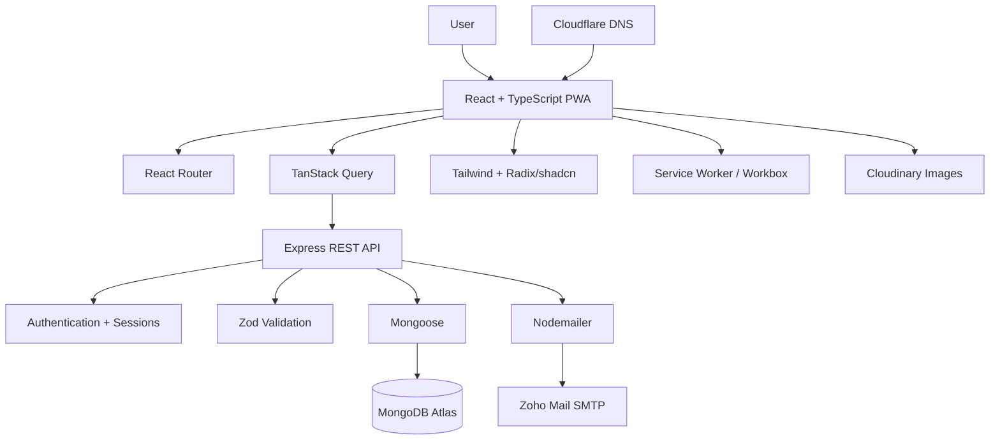

<div align="center">

# DevSangam

### A spiritual Sadhana and Digital Japamala companion

**Chant. Connect. Transform.**

[devsangam.me](https://devsangam.me) · [Product Requirements](./PRD.md)


</div>

---

## About DevSangam

DevSangam is a responsive spiritual-practice application built around a simple idea: make daily mantra Sadhana easier to begin, easier to continue, and easier to understand without turning spiritual practice into a noisy or overly gamified experience.

The application combines a curated mantra library, digital Japamala practice sessions, progress tracking, streaks, insights, profile preferences, and installable PWA behavior in one responsive web application.

DevSangam is designed as a **single React Progressive Web App** rather than separate web and native applications. The same product adapts its navigation and interaction patterns across desktop and mobile while sharing one frontend codebase.

> Project status: **pre-release**. Core product flows are implemented and the project is being prepared for production deployment and CI hardening.

---

## Table of contents

- [Product goals](#product-goals)
- [Core features](#core-features)
- [Architecture](#architecture)
- [Why this architecture](#why-this-architecture)
- [Technology stack](#technology-stack)
- [Repository structure](#repository-structure)
- [Application routes](#application-routes)
- [API structure](#api-structure)
- [Getting started](#getting-started)
- [Environment configuration](#environment-configuration)
- [MongoDB setup](#mongodb-setup)
- [Mantra data and images](#mantra-data-and-images)
- [Email configuration](#email-configuration)
- [Authentication and security](#authentication-and-security)
- [PWA and caching](#pwa-and-caching)
- [Development commands](#development-commands)
- [Build and quality checks](#build-and-quality-checks)
- [Deployment model](#deployment-model)
- [Development conventions](#development-conventions)
- [Troubleshooting](#troubleshooting)
- [Project documentation](#project-documentation)
- [License](#license)
- [Contact](#contact)

---

# Product goals

DevSangam focuses on a small number of high-value spiritual-practice workflows.

The product is intended to help a user:

1. Create an account securely.
2. Discover and understand mantras.
3. Choose a mantra and chanting target.
4. Complete a focused digital Japamala session.
5. Save practice history.
6. Maintain consistency and streaks.
7. Review personal insights over time.
8. Personalize their practice profile and preferences.
9. Use the application comfortably on desktop and mobile.
10. Install the experience as a PWA.

The first release deliberately avoids unrelated complexity. Social feeds, leaderboards, payments, chat, guru/follower systems, and AI spiritual advice are outside the current core scope.

---

# Core features

## Authentication

- Email/password registration
- Login and logout
- Access-token and refresh-token session handling
- HTTP-only authentication cookies
- Protected and guest-only frontend routes
- Forgot-password flow
- Single-use password-reset tokens
- 15-minute password-reset expiry
- Password reset through Zoho SMTP
- Session invalidation after password changes

## Dashboard

- Daily practice overview
- Streak-related data
- Recent sessions
- Quick access to practice
- Responsive desktop and mobile presentation

## Mantra library

- Curated mantra collection
- Sanskrit
- Transliteration
- Meaning and description
- Benefits
- Categories
- Deity metadata
- Suggested targets
- Estimated chant time
- Search
- Pagination
- Detail pages
- Direct practice flow
- Cloudinary imagery with local fallback support

The current curated seed contains **14 mantra records**.

## Practice

- Practice setup with or without a pre-selected mantra
- Searchable mantra selection
- Target-based chanting
- Mantra-specific session routes
- Session identifiers
- Progress tracking
- Session persistence through the API
- Completion flow
- Practice history integration

## Insights

- Practice statistics
- Streak information
- Aggregated chanting activity
- Session-based analytics
- Progress-oriented views

## Profile

- Name
- Avatar URL foundation
- Biography
- Spiritual intention
- Preferences
- Account information
- Responsive editing

Supported spiritual intentions currently include:

- Peace
- Focus
- Healing
- Discipline
- Devotion

## Progressive Web App

- Installable application manifest
- Standalone display mode
- PWA update handling
- Generated service worker
- SPA navigation fallback
- Runtime caching for mantra GET requests
- Runtime image caching
- Expired-cache cleanup

---

# Architecture



Simplified request path:

```text
Browser / Installed PWA
        |
        v
React 19 + TypeScript
        |
        +---- React Router
        +---- TanStack Query
        |
        v
REST API /api/v1
        |
        v
Express 5
        |
        +---- Zod validation
        +---- Auth/session services
        +---- Domain services
        |
        v
Mongoose 9
        |
        v
MongoDB Atlas
```

---

# Why this architecture

## One responsive PWA

DevSangam uses one responsive frontend instead of maintaining separate web and mobile applications.

This gives the project:

- one routing system
- one component system
- one authentication implementation
- one API client
- one design system
- one deployment artifact
- lower maintenance cost
- consistent behavior across devices

A native client can still be introduced later if genuinely native-only requirements justify the extra complexity.

## Monorepo

npm workspaces keep the frontend, backend, and shared packages together.

Benefits:

- shared TypeScript contracts
- synchronized dependency installation
- root-level build/lint/typecheck
- easier cross-stack refactors
- one source-control history

## REST API boundary

The browser never talks directly to MongoDB.

All application data flows through the Express API so authentication, validation, business rules, and database access remain centralized on the server.

---

# Technology stack

## Frontend

| Technology | Purpose | Why |
|---|---|---|
| React 19 | UI | Reusable components for a highly interactive product |
| TypeScript 6 | Static typing | Safer contracts and refactors |
| Vite 8 | Dev/build tooling | Fast local development and optimized production builds |
| React Router 8 | Routing | Guest/protected routes and route-driven sessions |
| TanStack Query 5 | Server state | Caching, invalidation, loading and refetching |
| Tailwind CSS 4 | Styling | Consistent responsive design without large CSS layers |
| Radix UI | Accessible primitives | Strong accessibility foundation without visual lock-in |
| shadcn | Component foundation | Reusable project-controlled UI patterns |
| React Hook Form | Forms | Efficient form state management |
| Zod | Validation | Typed client-side validation |
| Lucide React | Icons | Consistent lightweight iconography |
| Dexie | IndexedDB foundation | Local/offline persistence foundation |
| vite-plugin-pwa | PWA | Manifest and service-worker generation |

## Backend

| Technology | Purpose | Why |
|---|---|---|
| Node.js 26.7.0 | Runtime | Modern JavaScript/TypeScript server runtime |
| Express 5 | REST API | Simple, mature and well-suited to the product |
| TypeScript 6 | Backend typing | Safer services, controllers and models |
| MongoDB Atlas | Database | Managed document database |
| Mongoose 9 | ODM | Modeling, indexes, projections and database queries |
| Zod 4 | API validation | Rejects invalid external input at the boundary |
| jose | Auth tokens | Standards-based token signing/verification |
| Nodemailer | SMTP | Small, direct transactional-email integration |
| Zoho Mail | Email provider | Business mailbox and app SMTP from one provider |
| cookie-parser | Cookies | Authentication cookie parsing |

## Infrastructure

| Service | Role |
|---|---|
| Cloudflare | Authoritative DNS and edge/frontend deployment path |
| MongoDB Atlas | Managed application database |
| Cloudinary | Mantra image CDN |
| Zoho Mail | Domain mail and application SMTP |
| Namecheap | Domain registrar |
| GitHub | Source control and automation |

---

# Repository structure

```text
devsangam/
|
|-- .github/
|   `-- workflows/
|
|-- apps/
|   |-- web/
|   |   |-- public/
|   |   |-- src/
|   |   |   |-- app/
|   |   |   |-- assets/
|   |   |   |-- components/
|   |   |   |-- features/
|   |   |   |-- hooks/
|   |   |   |-- lib/
|   |   |   |-- services/
|   |   |   `-- styles/
|   |   |-- package.json
|   |   `-- vite.config.ts
|   |
|   `-- api/
|       |-- src/
|       |   |-- config/
|       |   |-- constants/
|       |   |-- controllers/
|       |   |-- middleware/
|       |   |-- models/
|       |   |-- routes/
|       |   |-- scripts/
|       |   |-- services/
|       |   |-- types/
|       |   |-- utils/
|       |   `-- validators/
|       |-- .env.example
|       `-- package.json
|
|-- packages/
|   |-- shared/
|   `-- types/
|
|-- PRD.md
|-- README.md
|-- package.json
|-- package-lock.json
`-- .nvmrc
```

`apps/web` is the React PWA. It is organized primarily by feature.

`apps/api` is the Express API. It separates routing, validation, controllers, services, models, configuration and utilities.

`packages/types` contains contracts shared across workspace boundaries.

`packages/shared` is available for logic genuinely shared by multiple workspaces.

---

# Application routes

| Route | Access | Purpose |
|---|---|---|
| `/` | Protected | Dashboard |
| `/auth/login` | Guest | Login |
| `/auth/register` | Guest | Registration |
| `/auth/forgot-password` | Guest | Request password reset |
| `/auth/reset-password` | Reset flow | Set a new password |
| `/library` | Protected | Mantra library |
| `/library/:slug` | Protected | Mantra details |
| `/practice` | Protected | Practice setup |
| `/practice/:mantraSlug/session/:sessionId` | Protected | Active practice session |
| `/insights` | Protected | Practice analytics |
| `/profile` | Protected | Profile |
| `/settings` | Protected | Settings |

A mantra can be pre-selected when entering practice:

```text
/practice?mantra=<mantra-slug>
```

Route pages are lazy-loaded with React `lazy()` and `Suspense`.

---

# API structure

Base path:

```text
/api/v1
```

Current route groups:

```text
/api/v1/health
/api/v1/auth
/api/v1/users
/api/v1/mantras
/api/v1/practice
/api/v1/insights
```

Authentication routes include:

```text
POST /api/v1/auth/register
POST /api/v1/auth/login
POST /api/v1/auth/refresh
POST /api/v1/auth/logout
POST /api/v1/auth/forgot-password
POST /api/v1/auth/reset-password
```

Backend inputs are validated before controller execution.

---

# Getting started

## Prerequisites

Install:

- Node.js **26.7.0**
- npm
- Git
- access to MongoDB

The repository contains `.nvmrc`.

```bash
nvm install
nvm use
```

Verify:

```bash
node --version
npm --version
```

## Clone

```bash
git clone https://github.com/shivammchaudhary1/devsangam.git
cd devsangam
```

## Install

From the repository root:

```bash
npm ci
```

Use `npm install` when intentionally changing dependencies/lockfile.

## Configure environment

```bash
cp apps/api/.env.example apps/api/.env
```

Fill in the required values below.

Never commit `apps/api/.env`.

## Start frontend and API together

```bash
npm run dev
```

Defaults:

```text
Web: http://localhost:5173
API: http://localhost:4000
```

Run individually when needed:

```bash
npm run dev:web
npm run dev:api
```

---

# Environment configuration

Template:

```text
apps/api/.env.example
```

```env
PORT=4000
WEB_ORIGIN=http://localhost:5173
MONGODB_URI=
ACCESS_TOKEN_SECRET=
REFRESH_TOKEN_SECRET=
NODE_ENV=development

EMAIL_HOST=smtp.zoho.in
EMAIL_PORT=465
EMAIL_USER=
EMAIL_PASSWORD=
EMAIL_FROM_NAME=DevSangam
EMAIL_FROM_ADDRESS=
```

| Variable | Required | Description |
|---|---:|---|
| `PORT` | No | API port; default is `4000` |
| `WEB_ORIGIN` | Yes for deployment | Allowed frontend origin and reset-link origin |
| `MONGODB_URI` | Yes | MongoDB connection URI |
| `ACCESS_TOKEN_SECRET` | Yes | Access-token secret |
| `REFRESH_TOKEN_SECRET` | Yes | Refresh-token secret |
| `NODE_ENV` | Yes for deployment | `development` or `production` |
| `EMAIL_HOST` | Yes for email | SMTP host |
| `EMAIL_PORT` | Yes for email | SMTP port |
| `EMAIL_USER` | Yes for email | SMTP mailbox username |
| `EMAIL_PASSWORD` | Yes for email | Zoho application-specific password |
| `EMAIL_FROM_NAME` | No | Friendly sender name |
| `EMAIL_FROM_ADDRESS` | No | From address; falls back to `EMAIL_USER` |

Generate strong independent token secrets:

```bash
node -e "console.log(require('node:crypto').randomBytes(64).toString('hex'))"
```

Run it twice and use different values for the access and refresh secrets.

Do not place production secrets in source control, documentation, issues, screenshots or pull requests.

---

# MongoDB setup

Set:

```env
MONGODB_URI=<your-mongodb-connection-string>
```

MongoDB Atlas is the intended hosted database.

## Seed mantras

```bash
npm run seed:mantras -w @devsangam/api
```

The seed uses slug-based upserts, making it safe to update existing records without blindly duplicating them.

## Synchronize indexes

All indexes:

```bash
npm run sync:indexes -w @devsangam/api
```

Mantra indexes:

```bash
npm run sync:mantra-indexes -w @devsangam/api
```

---

# Mantra data and images

Seed source:

```text
apps/api/src/scripts/seed-mantras.ts
```

Mantra records include fields such as:

```text
slug
Sanskrit
transliteration
meaning
description
benefits
categories
deity
targets
chant time
publication status
image URL
```

Current image strategy:

```text
MongoDB mantra.image
        |
        v
Cloudinary URL
```

The frontend prefers `mantra.image` and can use supported local assets as a fallback.

This keeps large content media outside MongoDB and outside the critical frontend bundle while still allowing a resilient UI.

---

# Email configuration

DevSangam uses **Zoho Mail** for business mail and backend SMTP.

Current domain mail structure:

```text
hello@devsangam.me      primary mailbox
contact@devsangam.me    alias
admin@devsangam.me      alias
```

Domain email authentication is configured with:

- MX
- SPF
- DKIM
- DMARC

DNS is managed through Cloudflare.

## Backend SMTP

The API uses Nodemailer with:

```env
EMAIL_HOST=smtp.zoho.in
EMAIL_PORT=465
EMAIL_USER=<mailbox-address>
EMAIL_PASSWORD=<zoho-app-password>
EMAIL_FROM_NAME=DevSangam
EMAIL_FROM_ADDRESS=<sender-address>
```

Use a **Zoho application-specific password** for `EMAIL_PASSWORD`, not the normal interactive account password.

## Password-reset flow

```text
User submits email
        |
        v
POST /api/v1/auth/forgot-password
        |
        v
Account lookup
        |
        v
Random token
        |
        +---- hash stored in MongoDB
        |
        +---- raw token placed in reset URL
        |
        v
Zoho SMTP email
        |
        v
/auth/reset-password?token=...
```

Reset tokens expire after 15 minutes.

The forgot-password endpoint intentionally returns a generic response whether or not an account exists, reducing account-enumeration risk.

---

# Authentication and security

Current security architecture includes:

- password hashing
- separate access and refresh secrets
- cookie-based auth delivery
- server-side auth-session records
- refresh-session rotation
- session revocation
- hashed password-reset tokens
- reset-token expiry
- single-use reset tokens
- all-session invalidation after password changes
- Zod request validation
- non-enumerating forgot-password responses
- CORS tied to `WEB_ORIGIN`
- ignored local `.env` secrets

Before production:

- set strong independent token secrets
- set `NODE_ENV=production`
- configure the exact production `WEB_ORIGIN`
- use production MongoDB credentials
- keep secrets only in the hosting provider's secret store
- enforce HTTPS
- verify cross-origin cookies
- verify CORS on the real domain
- verify SMTP in production
- run index synchronization
- complete production smoke tests

---

# PWA and caching

PWA configuration:

```text
apps/web/vite.config.ts
```

The manifest defines DevSangam as a standalone installable application with dedicated PWA icons and a dark theme.

Service-worker updates use a prompt-based flow.

## Precache

Supported build resources include:

```text
JavaScript
CSS
HTML
SVG
PNG
WebP
JPEG
WOFF
WOFF2
```

A maximum precache file size prevents oversized assets from being pulled automatically into the main precache.

## Mantra API caching

GET requests beginning with:

```text
/api/v1/mantras
```

use **Network First**.

This favors fresh server data while allowing cached read-only mantra content when the network is unavailable or slow.

## Image caching

Images use **Cache First**, reducing repeat media downloads for relatively stable content imagery.

Dynamic mutation endpoints are not broadly cached.

---

# Development commands

Run all commands from the repository root unless noted.

| Task | Command |
|---|---|
| Start web + API | `npm run dev` |
| Start web only | `npm run dev:web` |
| Start API only | `npm run dev:api` |
| Lint | `npm run lint` |
| Auto-fix lint | `npm run lint:fix` |
| Typecheck | `npm run typecheck` |
| Build all workspaces | `npm run build` |
| Preview web build | `npm run preview -w @devsangam/web` |
| Seed mantras | `npm run seed:mantras -w @devsangam/api` |
| Sync all indexes | `npm run sync:indexes -w @devsangam/api` |
| Sync mantra indexes | `npm run sync:mantra-indexes -w @devsangam/api` |

Build and start only the API:

```bash
npm run build -w @devsangam/api
npm run start -w @devsangam/api
```

---

# Build and quality checks

Before committing significant work:

```bash
npm run lint
npm run typecheck
npm run build
git diff --check
```

| Check | Protects against |
|---|---|
| `npm run lint` | Code-quality/import/style regressions |
| `npm run typecheck` | Type errors |
| `npm run build` | Production compilation failures |
| `git diff --check` | Invalid whitespace in the diff |

Confirm secrets remain ignored:

```bash
git check-ignore apps/api/.env
```

Expected:

```text
apps/api/.env
```

---

# Deployment model

```text
Namecheap
   |
   | domain registration
   v
Cloudflare
   |
   | authoritative DNS
   +-------------------------+
   |                         |
   v                         v
Frontend/PWA             API hosting
                             |
                             v
                        MongoDB Atlas
                             |
                             +---- Zoho SMTP

Cloudinary
   ^
   |
mantra images
```

## Domain

```text
devsangam.me
```

Cloudflare is the authoritative DNS provider.

## Frontend

Build:

```bash
npm run build -w @devsangam/web
```

Output:

```text
apps/web/dist
```

A frontend host must:

- serve static Vite assets
- support HTTPS
- support SPA fallback to `index.html`
- serve the generated PWA files correctly

## API

Build:

```bash
npm run build -w @devsangam/api
```

Start:

```bash
npm run start -w @devsangam/api
```

The final API host must support the Node runtime and the features required by Express, Mongoose, Nodemailer, cookies, and outbound MongoDB/SMTP connections.

Do not assume every edge-worker runtime is fully Node-compatible. Verify compatibility before choosing a backend deployment target.

## Production variables

The deployed API needs:

```text
PORT
WEB_ORIGIN
MONGODB_URI
ACCESS_TOKEN_SECRET
REFRESH_TOKEN_SECRET
NODE_ENV
EMAIL_HOST
EMAIL_PORT
EMAIL_USER
EMAIL_PASSWORD
EMAIL_FROM_NAME
EMAIL_FROM_ADDRESS
```

Credentials and secrets belong in the hosting platform's environment/secret manager.

---

# Development conventions

## Frontend

Prefer feature ownership:

```text
apps/web/src/features/<feature>
```

Move code to globally shared folders only when multiple features genuinely own it.

## Backend

Keep request processing layered:

```text
route
  |
  v
validation middleware
  |
  v
controller
  |
  v
service/domain logic
  |
  v
model/database
```

Controllers should remain focused on HTTP concerns.

## Validation

External data must be validated at the boundary.

```text
request
  -> Zod schema
  -> validated controller input
```

Frontend validation improves UX but never replaces backend validation.

## Shared types

Cross-workspace contracts should live in the shared types workspace instead of being duplicated.

## Frontend secrets

Never expose server secrets through browser code or public Vite configuration.

Anything delivered to the browser must be treated as public.

---

# Troubleshooting

## MongoDB connection fails

Check `MONGODB_URI` and verify:

- Atlas database user
- password
- network access
- connection string
- database reachability

## CORS error

Check:

```env
WEB_ORIGIN=http://localhost:5173
```

The value must exactly match the frontend origin.

## Forgot-password returns success but email does not arrive

The endpoint intentionally returns a generic success response.

Check API logs and verify:

```text
EMAIL_HOST
EMAIL_PORT
EMAIL_USER
EMAIL_PASSWORD
EMAIL_FROM_ADDRESS
```

Also check:

- Zoho app password
- spam folder
- SMTP access
- domain MX/SPF/DKIM/DMARC status

## Reset link points to localhost in production

Set:

```env
WEB_ORIGIN=https://devsangam.me
```

or the exact final production frontend origin.

## Frontend deep links return 404

Configure the static host to route unknown frontend paths to:

```text
/index.html
```

React Router must receive routes such as `/library/<slug>`, `/profile` and `/insights`.

## PWA version appears stale

During debugging:

1. accept the application's update prompt
2. reload
3. reopen the installed PWA
4. inspect the service worker in browser developer tools

Do not disable production caching simply to hide an update-flow problem.

## SMTP authentication fails

Verify the exact Zoho server configuration for the account.

Current setup uses:

```text
Host: smtp.zoho.in
Port: 465
Username: configured Zoho mailbox
Password: application-specific password
```

---

# Project documentation

`README.md` is the engineering entry point:

- architecture
- technology decisions
- local setup
- environment configuration
- development commands
- deployment model
- troubleshooting

`PRD.md` contains deeper product requirements and product direction.

Keeping those responsibilities separate prevents the README from becoming a stale product backlog.

---

# Release checklist

Before a production release:

```text
1. Install from the lockfile
2. Configure production environment values
3. Verify MongoDB
4. Seed/synchronize required data
5. Synchronize indexes
6. Run lint
7. Run typecheck
8. Run production build
9. Run git diff --check
10. Verify API health
11. Test registration/login/logout
12. Test password reset
13. Test protected routes
14. Test mantra library and detail pages
15. Test practice start and completion
16. Test dashboard and insights
17. Test profile updates
18. Test desktop UI
19. Test mobile UI
20. Test PWA installation and update flow
21. Test cookies and CORS on the real domain
22. Verify production email delivery
23. Monitor the replacement deployment
```

Do not retire an existing working production environment until its replacement has passed production smoke tests and monitoring.

---

# Roadmap

Near-term engineering work includes:

- GitHub Actions CI
- final regression QA
- production frontend deployment
- final backend-host compatibility decision
- production secret configuration
- deployment smoke testing
- profile-avatar upload pipeline when required
- continued offline/local-persistence improvements where they add real value

DevSangam remains intentionally focused on improving the quality and reliability of the Sadhana experience before expanding into unrelated product areas.

---

# License

DevSangam is distributed under the **ISC License**.

See [`LICENSE`](./LICENSE) for the full license text.

---

# Contact

Project: **DevSangam**

Website: [devsangam.me](https://devsangam.me)

General: `contact@devsangam.me`

Administrative: `admin@devsangam.me`

---

<div align="center">

### DevSangam

**Chant. Connect. Transform.**

Built as a focused, modern and maintainable digital Sadhana companion.

</div>
